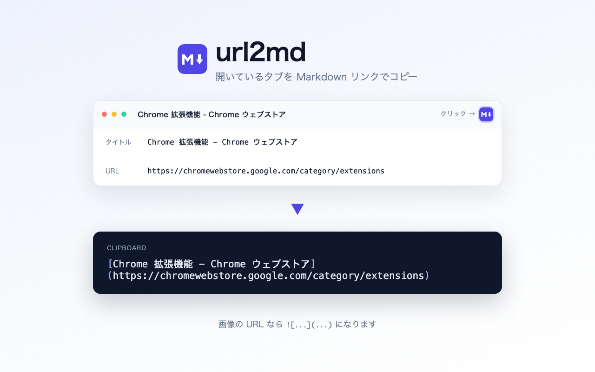

# url2md

現在開いているタブを **Markdown のリンク記法でクリップボードにコピー**する Chrome 拡張です。

```
[ページタイトル](https://example.com)
   ← 画像 URL のときは ! が付きます
```

## できること

ツールバーの拡張機能アイコンをクリックすると、そのタブが Markdown 形式でコピーされます。
成功するとアイコンに緑のバッジ (✓)、失敗すると赤いバッジ (!) が一瞬表示されます。

クリップボードへの書き込みに offscreen document を使っているため、ページへスクリプトを
注入する必要がなく、`chrome://extensions/` のような Chrome の内部ページでもコピーできます。



## URL のクリーンアップ

コピーする前に URL を整えます。どちらも**デフォルトで有効**で、拡張機能アイコンを
右クリック →「オプション」から個別にオフにできます。

| 設定 | 内容 |
| --- | --- |
| Amazon の URL を最小化 | 商品ページを `https://www.amazon.co.jp/dp/ASIN` まで削ります（`/ref=...` やアフィリエイトタグ、検索由来のパラメータが消えます） |
| トラッキング・リファラーパラメータを除去 | `utm_*` `ref` `fbclid` `gclid` `msclkid` などを除去します。X の `?s=20&t=...`、YouTube の `?si=...` や自動生成ミックス `?list=RD...&start_radio=1` といったサイト固有のものにも対応 |

```
変換前  https://www.amazon.co.jp/Echo-Dot/dp/B09B8VGCR8/ref=cm_sw_r_apan_dp_XYZ?th=1
変換後  https://www.amazon.co.jp/dp/B09B8VGCR8

変換前  https://www.youtube.com/watch?v=uZ1NmQWL6gg&list=RDuZ1NmQWL6gg&start_radio=1
変換後  https://www.youtube.com/watch?v=uZ1NmQWL6gg
```

タイトルの先頭に付く未読件数（YouTube の `(25) `、Gmail の `(1,234) ` など）も取り除きます。

誤爆を避けるため、次の場合は URL に手を加えません。

- GitHub / GitLab / Bitbucket / Codeberg の `?ref=` はブランチ名として使われるため残します
- YouTube の再生位置 `?t=` のように意味のあるパラメータは残します
- YouTube のプレイリストは、自動生成のミックス (`list=RD...`) だけを落とし、自分で作ったもの (`list=PL...`) やアルバム (`list=OLAK5uy_...`) は残します
- `(2026) ` のような 4 桁の数字はタイトルの一部とみなして残します
- 除去対象が 1 つもなかった URL は、元の文字列をそのまま返します（再エンコードによる変化を防ぐため）

## インストール

```sh
npm ci
npm run build
```

`chrome://extensions` を開き、「デベロッパー モード」を ON にして **「パッケージ化されていない拡張機能を読み込む」** から `dist` を選択します。

配布用の zip が必要な場合は `npm run zip` で `url2md.zip` が生成されます。

## 開発

| コマンド | 内容 |
| --- | --- |
| `npm run dev` | ソースを監視して `dist` を再ビルド (変更後は拡張機能ページで再読み込み) |
| `npm run build` | 本番ビルド |
| `npm run typecheck` | 型チェック (`tsc --noEmit`) |
| `npm test` | Vitest による URL クリーンアップのテスト |
| `npm run lint` | Biome による lint / format チェック |
| `npm run format` | Biome で自動修正 |

### 構成

| パス | 役割 |
| --- | --- |
| `src/service-worker.ts` | MV3 の service worker。アイコンのクリックを受けて Markdown を組み立て、offscreen document 経由でコピーする |
| `offscreen.html` / `src/offscreen.ts` | クリップボード書き込み専用の非表示ページ |
| `src/url-cleaner.ts` | Amazon URL の最小化とトラッキングパラメータ除去のルール（`src/url-cleaner.test.ts` にテスト） |
| `src/markdown.ts` | Markdown リンクの組み立てとタイトルの整形（`src/markdown.test.ts` にテスト） |
| `src/settings.ts` | `chrome.storage.sync` に保存する設定とその既定値 |
| `options.html` / `src/options.ts` | 設定画面。変換結果をその場で確認できる |
| `public/manifest.json` | Manifest V3。`public/` 以下はそのまま `dist/` にコピーされる |
| `vite.config.ts` | Vite のビルド設定 |
| `assets/` | アイコン・ストア掲載画像の生成元 (SVG / HTML)。ビルドには含まれない |
| `store/` | Chrome ウェブストア提出用の画像と[掲載情報](store/LISTING.md) |

- 要件: Node.js 20 以上 / Chrome 116 以上
- 権限は `activeTab` / `storage` / `offscreen` / `clipboardWrite` のみ。アイコンをクリックしたタブ以外にはアクセスしません

## 公開

Chrome ウェブストアへの提出手順・掲載文面・権限の説明文は [`store/LISTING.md`](store/LISTING.md) にまとめてあります。

```sh
npm run zip   # -> url2md.zip をアップロード
```

バージョンを上げるときは `package.json` と `public/manifest.json` の `version` を必ず揃えてください。

プライバシーポリシー: [PRIVACY.md](PRIVACY.md)（データの収集・送信は一切ありません）

## ライセンス

MIT
